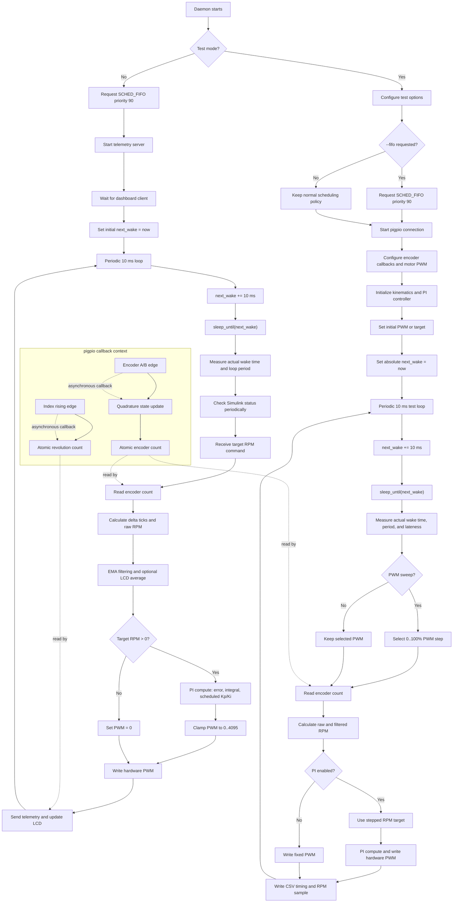

# MIXR-1 Scheduling Architecture

The daemon uses a periodic 10 ms control loop. The loop attempts to run with `SCHED_FIFO` priority 90 when launched with sufficient privileges. Timing is scheduled against an absolute `next_wake` deadline so small execution variations do not continuously shift the nominal loop schedule.



## Scheduling Roles

| Component | Scheduling role | Data exchanged |
|---|---|---|
| Main daemon thread | Runs dashboard control loop every 10 ms | Target RPM, PWM, RPM telemetry |
| Test loop | Runs the same 10 ms cadence and logs timing | PWM/target steps, raw RPM, loop period, lateness |
| Encoder callbacks | Asynchronously process quadrature edges | Atomic encoder tick count |
| PI controller | Executes inside the main/test loop | RPM error and PWM command |
| pigpio hardware PWM | Generates the motor waveform independently | PWM duty cycle |
| Network and LCD work | Executes in the normal loop after control output | Dashboard/LCD updates |

## FIFO Comparison

The scheduling experiment compares the same test in two conditions:

- `--no-fifo`: normal Linux scheduling
- `--fifo`: main test thread requests `SCHED_FIFO` priority 90

The CSV timing fields are:

- `loop_period_us`: time between actual loop iterations
- `late_us`: time after the intended absolute wake deadline
- `raw_rpm`: encoder-derived RPM before display filtering

A useful presentation comparison is the standard deviation of `loop_period_us`, the maximum `late_us`, the count of late cycles, and the raw RPM standard deviation at each identical PWM level.

## Commands

Open-loop PWM characterization:

```bash
sudo ./mixr1_daemon --test --sweep --no-fifo --no-pi \
  --duration=10 --target=0 --csv=open_loop_no_fifo.csv

sudo ./mixr1_daemon --test --sweep --fifo --no-pi \
  --duration=10 --target=0 --csv=open_loop_fifo.csv
```

PI setpoint characterization:

```bash
sudo ./mixr1_daemon --test --sweep --no-fifo --pi \
  --target=2500 --duration=10 --csv=pi_no_fifo.csv

sudo ./mixr1_daemon --test --sweep --fifo --pi \
  --target=2500 --duration=10 --csv=pi_fifo.csv
```
